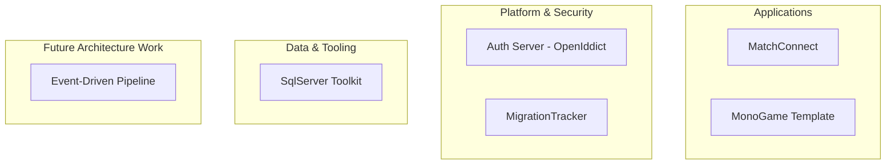

  

# Hi, I'm Cat 🐱  
Technical Lead / Software Developer focused on backend systems, full-stack development, and software architecture.

I specialize in designing and building reliable, maintainable software systems across backend services, cloud platforms, and game development.

---

## Technologies

| Skills | Applied Work |
|--------|-------------|
| ⚙️ .NET / ASP.NET Core | Full-stack web applications (MatchConnect, Auth systems) |
| ☁️ Azure Cloud Services | Event-driven architecture exploration (in progress) |
| 🔐 Authentication / OAuth2 / JWT | OpenIddict.AuthorizationServer |
| 🗄️ SQL Server / Data Design | MigrationTracker, SQL toolkit |
| 🌐 SPA Development (TypeScript) | Angular-based client architecture |
| 🎮 Game Development (MonoGame) | MonoGameTemplate.Net8 |
| 🧱 System Design | MigrationTracker, Auth Server |
| 🔄 Data Pipelines | Transaction analysis + logging concepts (planned) |

---

## ⭐ Highlighted Projects

### [MigrationTracker](https://github.com/CatFortman/MigrationTracker)  
 

Simplify database schema versioning with automated migration tracking and execution. Inspired by SQL source control and modern schema management patterns.

**Features**: Version control for migrations • Rollback support • Audit logging

---

### [MonoGameTemplate.Net8](https://github.com/CatFortman/MonoGameTemplate.Net8)  
 

Reusable MonoGame 3.8 template for .NET 8, structured for rapid 2D game development with shared architecture and content pipeline support.

**Features**: Pre-configured project structure • Content pipeline setup • Shared architecture patterns

---

### [SqlServer.EngineeringToolkit](https://github.com/CatFortman/SqlServer.EngineeringToolkit)  
 

Collection of SQL Server scripts covering database operations, debugging, schema analysis, and maintenance patterns.

**Features**: Performance debugging • Schema analysis • Maintenance utilities

---

### [OpenIddict.AuthorizationServer](https://github.com/CatFortman/OpenIddict.AuthorizationServer)  
 

OAuth2 / OpenID Connect authorization server implementing authentication flows using OpenIddict.

**Features**: OAuth2 flows • OpenID Connect • Token management

---
## 🗺️ Domain Map

## 💯 GitHub Stats

---

